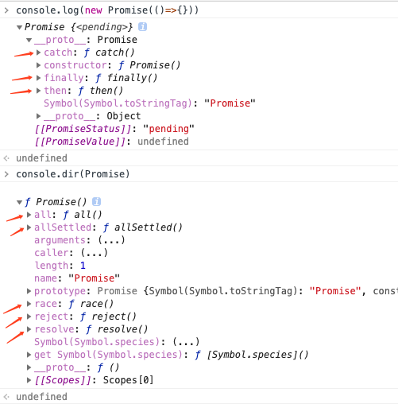
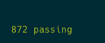

# 手写Promise A+, 已通过官方872个测试用例
Promise 是 ES6 中得一个内置类。Promise 在有效规划异步编程代码，尤其是处理 ajax 异步请求的回调地狱上都有很大的帮助。

在 JS 中，Promise 和 async/await 作为主流的异步处理方式，我们有必要了解实现原理。

## Promise A+ 规范

Promise 最早由社区提出和实现，ES6 将其写进了语言标准，统一了用法，原生提供了 Promise 对象。
目前 Promise A+ 规范为主流，也是我们学习的目标。详细内容可以看官方文档 https://promisesaplus.com/

规范内容较长，总结为以下几点：

#### 1. Promise 状态([PromiseA+ 2.1](https://promisesaplus.com/#promise-states))

Promise 有三种状态，分别是 pending（等待）、fulfilled（执行）、rejected（拒绝）

Promise 的初始状态为 pending，一旦被修改为 fulfilled 或者 rejected 后，状态不能再改变

#### 2. then 函数([PromiseA+ 2.2](https://promisesaplus.com/#the-then-method))

then 函数接受两个函数作为可选参数

```js
promise.then(onFulfilled, onRejected);
```

then 函数遵循以下几个规则：

- 参数不为函数时应该被忽略
- 两个参数函数都应该异步执行，即放入事件队列，而非同步立即执行
- 调用 onFulfilled 函数时，会将当前 Promise 的值作为参数传入
- 调用 onRejected 函数时，会将当前 Promise 的失败原因作为参数传入
- then 函数的返回值为 Promise

#### 3. Promise 解决过程([PromiseA+ 2.3](https://promisesaplus.com/#the-promise-resolution-procedure))

Promise 解决过程是一个抽象的操作，接收一个 promise 和一个值 x，目的是对 Promise 形式的执行结果进行统一处理。按照规范文档，有以下三种情况

- promise 等于 x。此时抛出 TypeError 错误，拒绝 promise
- x 是 Promise 的一个实例。此时如果 x 为 pending（等待）状态，则 promise 继续等待直至 x 变为 fulfilled（执行）或者 rejected（拒绝），否则根据 x 的状态来 fulfilled（执行）/rejected（拒绝）promise
- x 为对象或者函数 这一步是处理拥有 then()函数的对象或者函数（这类对象或者函数不是 Promise 实例，只是拥有 then 函数）。处理方式是调用 then()方法，调用时将 this 指向 x,将 then 回调函数的结果 y 传入新的 Promise 解决过程，如果执行期间报错，则以对应的错误为原因拒绝 promise

## ES5 实现 Promise 源码过程（三部曲）

### 1. 初始化

<!--  -->
* 确定promise三种状态
* promise的构造函数需要传一个函数作为参数。该函数具备resolve、reject两个参数
* 执行resolve/reject时修改状态、值、执行回调函数
```js
// promise三种状态
var PENDING = 'pending';
var FULFILLED = 'fulfilled';
var REJECTED = 'rejected';
// 构造函数
function MyPromise(executor) {
  // 初始状态为peding,初始值为空
  this.status = PENDING;
  this.value = null;
  this.onFulfilledFn = []; // 存放成功的回调函数
  this.onRejectedFn = []; // 存放失败的回调函数
  var _this = this;

  function resolve(value) {
    // setTimeout构成异步
    setTimeout(function() {
      // 一旦被修改为 fulfilled 或者 rejected 后，状态不能再改变
      if (_this.status === PENDING) {
        _this.status = FULFILLED;
        _this.value = value;
        _this.onFulfilledFn.forEach(function (fn) {
          fn(_this.value);
        });
      }
    }, 0);
  }
  function reject(reason) {
    // setTimeout构成异步
    setTimeout(function() {
      // 一旦被修改为 fulfilled 或者 rejected 后，状态不能再改变
      if (_this.status === PENDING) {
        _this.status = REJECTED;
        _this.value = reason;
        _this.onRejectedFn.forEach(function (fn) {
          fn(_this.value);
        });
      }
    }, 0);
  }
  try {
    // 执行参数
    executor(resolve, reject);
  } catch (e) {
    // 报错则返回reject
    reject(e);
  }
}
// 原型方法
MyPromise.prototype = {
  constructor: MyPromise,
  then: function() {},
  catch: function() {},
  finally: function() {},
};
// 静态方法
MyPromise.resolve = function() {};
MyPromise.reject = function() {};
MyPromise.all = function() {};
MyPromise.race = function() {};
MyPromise.allSetted = function() {};
```

### 2. 加入then函数

```js
MyPromise.prototype = {
  constructor: MyPromise,
  then: function (onFulfilled, onRejected) {
    var _this = this;
    if (typeof onFulfilled !== 'function') {
      // PromiseA+ 2.2.1 参数不是函数，直接忽略
      onFulfilled = function (value) {
        // 链式调用。返回promise
        return MyPromise.resolve(value);
      };
    }
    if (typeof onRejected !== 'function') {
      // PromiseA+ 2.2.1 参数不是函数，直接忽略
      onRejected = function (reason) {
        // 链式调用。返回promise
        return MyPromise.reject(reason);
      };
    }
    // PromiseA+ 2.2.7 返回promise供链式调用。
    var promise;
    switch (_this.status) {
      case FULFILLED:
        promise = new MyPromise(function (resolve, reject) {
          setTimeout(function () {
            // 用try/catch包一层 执行传入的回调函数，报错则reject
            try {
              var x = onFulfilled(_this.value);
              resolvePromise(promise, x, resolve, reject);
            } catch (e) {
              reject(e);
            }
          }, 0);
        });
        break;
      case REJECTED:
        promise = new MyPromise(function (resolve, reject) {
          setTimeout(function () {
            try {
              var x = onRejected(_this.value);
              resolvePromise(promise, x, resolve, reject);
            } catch (e) {
              reject(e);
            }
          }, 0);
        });
        break;
      case PENDING:
        promise = new MyPromise(function (resolve, reject) {
          // pending时，将回调函数存放onFulfilledFn，等待状态改变后执行。
          _this.onFulfilledFn.push(function () {
            try {
              var x = onFulfilled(_this.value);
              resolvePromise(promise, x, resolve, reject);
            } catch (e) {
              reject(e);
            }
          });
          _this.onRejectedFn.push(function () {
            try {
              var x = onRejected(_this.value);
              resolvePromise(promise, x, resolve, reject);
            } catch (e) {
              reject(e);
            }
          });
        });
        break;
    }
    return promise;
  },
  catch: function (fn) {
    // catch的本质就是then方法只传第二个参数
    this.then(null, fn);
  },
};
```

### 3. Promise 解决过程 - resolvePromise()
```js
function resolvePromise(promise, x, resolve, reject) {
  if (promise === x) {
    return reject(new TypeError('x 不能和 promise相等'));
  }
  // x是promise实例
  if (x instanceof MyPromise) {
    if (x.status === FULFILLED) {
      resolve(x.value);
    } else if (x.status === REJECTED) {
      reject(x.value);
    } else {
      // pending状态，继续等待
      x.then(function (y) {
        resolvePromise(promise, y, resolve, reject);
      }, reject);
    }
  } else if (x && (typeof x === 'object' || typeof x === 'function')) {
    // x不是promise实例，是object/function
    var executed;
    try {
      var then = x.then;
      // 具备then方法
      if (typeof then === 'function') {
        // 调用then,this指向x
        then.call(
          x,
          function (y) {
            if (executed) return;
            executed = true;
            // 回调函数的结果 y 传入新的 Promise 解决过程
            resolvePromise(promise, y, resolve, reject);
          },
          function (e) {
            if (executed) return;
            executed = true;
            reject(e);
          }
        );
      } else {
        // 不具备then方法 直接resolve
        resolve(x);
      }
    } catch (e) {
      // 执行过程中报错 直接reject
      if (executed) return;
      executed = true;
      reject(e);
    }
  } else {
    // 非object和function，直接resolve
    resolve(x);
  }
}
```

## Promise测试
为了验证手写Promise的正确性，这里引用官方promise测试库来测试。
官方测试库： https://github.com/promises-aplus/promises-tests
项目里直接install
```js
npm install promises-aplus-tests
```
```js
// 调用官方测试用例，需实现一个promise的延迟对象 defer
MyPromise.defer = MyPromise.deferred = function() {
  let dfd = {};
  dfd.promise = new MyPromise((resolve, reject) => {
    dfd.resolve = resolve;
    dfd.reject = reject;
  });
  return dfd;
};

promisesAplusTests(MyPromise, function(err) {
  console.log(err);
});
```

872个测试用例全部通过～
## Promise 源码完整版

```javascript
// 调用官方测试库 保证手写代码的正确性
const promisesAplusTests = require('promises-aplus-tests');
// https://promisesaplus.com/#point-5
var PENDING = 'pending';
var FULFILLED = 'fulfilled';
var REJECTED = 'rejected';

function resolvePromise(promise, x, resolve, reject) {
  if (promise === x) {
    return reject(new TypeError('x 不能和 promise相等'));
  }
  if (x instanceof MyPromise) {
    if (x.status === FULFILLED) {
      resolve(x.value);
    } else if (x.status === REJECTED) {
      reject(x.value);
    } else {
      x.then(function(y) {
        resolvePromise(promise, y, resolve, reject);
      }, reject);
    }
  } else if (x && (typeof x === 'object' || typeof x === 'function')) {
    var executed;
    try {
      var then = x.then;
      if (typeof then === 'function') {
        then.call(
          x,
          function(y) {
            if (executed) return;
            executed = true;
            resolvePromise(promise, y, resolve, reject);
          },
          function(e) {
            if (executed) return;
            executed = true;
            reject(e);
          }
        );
      } else {
        resolve(x);
      }
    } catch (e) {
      if (executed) return;
      executed = true;
      reject(e);
    }
  } else {
    resolve(x);
  }
}
// 构造函数
function MyPromise(executor) {
  this.status = PENDING;
  this.value = null;
  this.onFulfilledFn = [];
  this.onRejectedFn = [];
  var _this = this;

  function resolve(value) {
    setTimeout(function() {
      if (_this.status === PENDING) {
        _this.status = FULFILLED;
        _this.value = value;
        _this.onFulfilledFn.forEach(function(fn) {
          fn(_this.value);
        });
      }
    }, 0);
  }
  function reject(reason) {
    setTimeout(function() {
      if (_this.status === PENDING) {
        _this.status = REJECTED;
        _this.value = reason;
        _this.onRejectedFn.forEach(function(fn) {
          fn(_this.value);
        });
      }
    }, 0);
  }
  try {
    executor(resolve, reject);
  } catch (e) {
    reject(e.message);
  }
}

MyPromise.prototype = {
  constructor: MyPromise,
  then: function(onFulfilled, onRejected) {
    var _this = this;
    if (typeof onFulfilled !== 'function') {
      onFulfilled = function(value) {
        return MyPromise.resolve(value);
      };
    }
    if (typeof onRejected !== 'function') {
      onRejected = function(reason) {
        return MyPromise.reject(reason);
      };
    }
    var promise;
    switch (_this.status) {
      case FULFILLED:
        promise = new MyPromise(function(resolve, reject) {
          setTimeout(function() {
            try {
              var x = onFulfilled(_this.value);
              resolvePromise(promise, x, resolve, reject);
            } catch (e) {
              reject(e);
            }
          }, 0);
        });
        break;
      case REJECTED:
        promise = new MyPromise(function(resolve, reject) {
          setTimeout(function() {
            try {
              var x = onRejected(_this.value);
              resolvePromise(promise, x, resolve, reject);
            } catch (e) {
              reject(e);
            }
          }, 0);
        });
        break;
      case PENDING:
        promise = new MyPromise(function(resolve, reject) {
          _this.onFulfilledFn.push(function() {
            try {
              var x = onFulfilled(_this.value);
              resolvePromise(promise, x, resolve, reject);
            } catch (e) {
              reject(e);
            }
          });
          _this.onRejectedFn.push(function() {
            try {
              var x = onRejected(_this.value);
              resolvePromise(promise, x, resolve, reject);
            } catch (e) {
              reject(e);
            }
          });
        });
        break;
    }
    return promise;
  },
  catch: function(fn) {
    this.then(null, fn);
  },
  finally: function(fn) {},
};

MyPromise.resolve = function(value) {
  return new MyPromise(function(resolve) {
    resolve(value);
  });
};
MyPromise.reject = function(reason) {
  return new MyPromise(function(_, reject) {
    reject(reason);
  });
};

// 调用官方测试用例，需实现一个promise的延迟对象 defer
MyPromise.defer = MyPromise.deferred = function() {
  let dfd = {};
  dfd.promise = new MyPromise((resolve, reject) => {
    dfd.resolve = resolve;
    dfd.reject = reject;
  });
  return dfd;
};

promisesAplusTests(MyPromise, function(err) {
  console.log(err);
});
```
