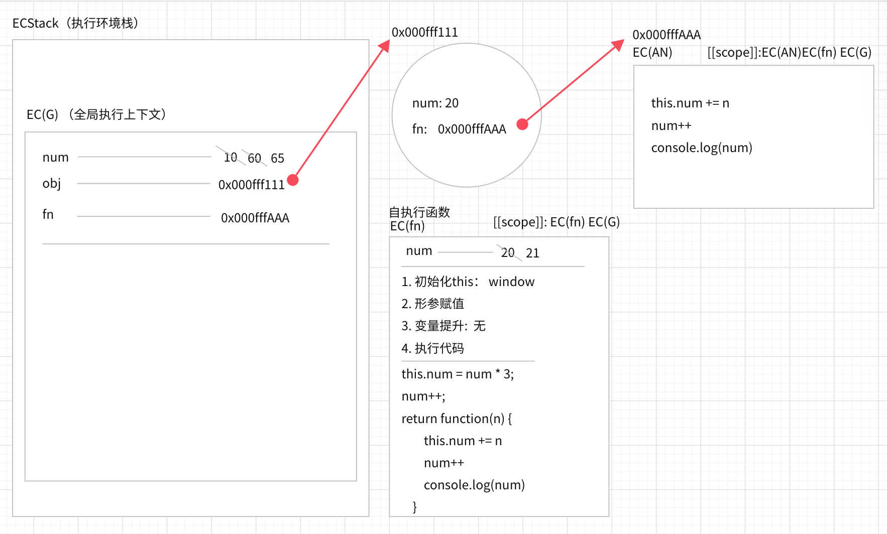
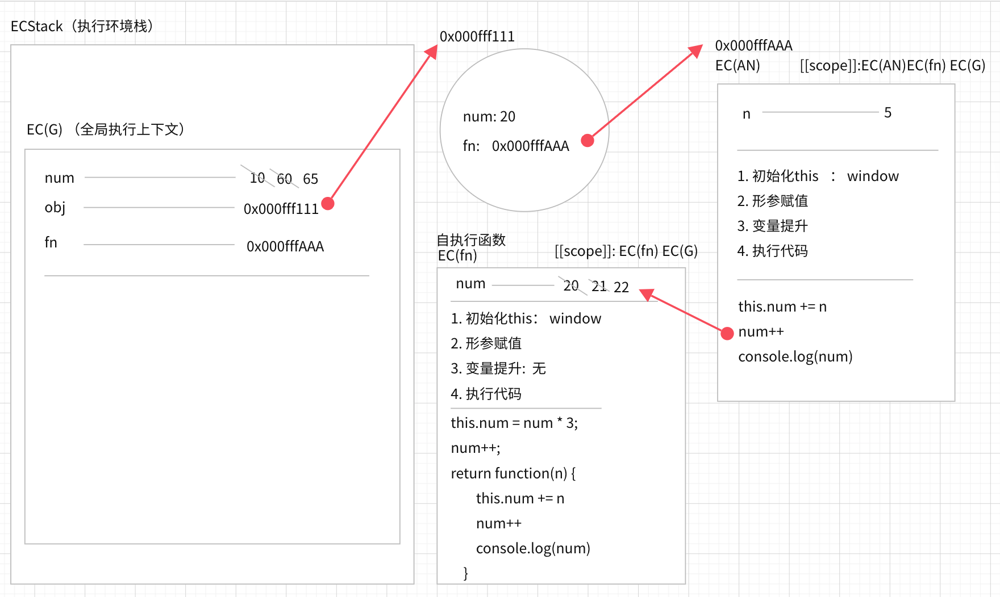
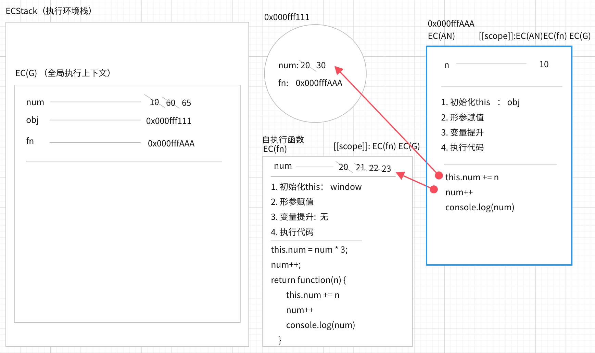
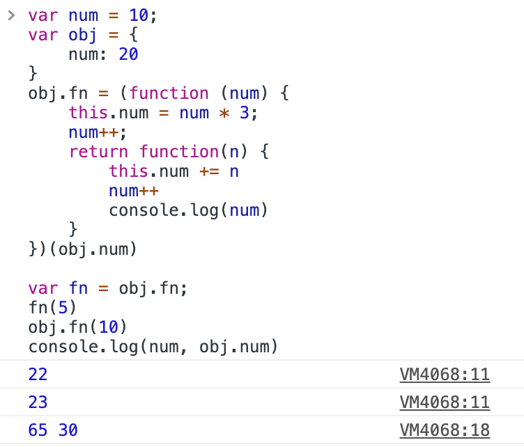

## this是什么？

this是**执行主体**, 不是执行上下文（execution context才是），谁来触发某个事件，谁就是执行主体

1. 在全局上下文中，this => window (global)

2. 块级上下文没有自己的this,继承所在上下文的this

3. 函数私有上下文，this的情况会多种多样

## 函数私有上下文关于this的五种情况

1. 事件绑定中，给元素某个事件行为绑定方法，事件行为触发，方法执行，方法中都this是当前元素本身

```js
// DOM0
let body = document.getElementById('tt')
body.onclick = function () {
  console.dir(this)  // => body
}
// DOM2
body.addEventListener('click', function (params) {
  console.dir(this) // => body
})
```

2. 普通方法执行（自执行函数、普通函数、对象成员访问调取方法执行等）
有“点”就是“点”之前的，没点就是window[非严格模式]/undefined[严格模式]

```js
(function() {
    console.log(this) //window
})()


var obj = {
    fn: (function() {
        console.log(this) //window
        return function() {}
    })()
}

function func() {
    console.log(this)
}

var obj = {
    func: func
}
func() // window
obj.func() // obj
```

3. 构造函数（new) 构造函数体的this是当前类的实例
4. es6 箭头函数: 箭头函数没有自己的this,继承所在上下文的this
5. 基于 call apply bind 手动改变函数this

```js
let obj = {
    func: function() {
        console.log(this)
    },
    sum: () => {
        console.log(this)
    }
}
obj.func()
obj.sum()

let obj1 = {
    i: 0,
    func() {
        // this: obj1
        setTimeout(function(){
            // this: 此回调函数中this是window
            this.i++
        },1000)
    }
}
```

## 实战分析

根据下列代码一步一步解析this指向
```js
var num = 10;
var obj = {
    num: 20
}
obj.fn = (function (num) {
    this.num = num * 3;
    num++;
    return function(n) {
        this.num += n
        num++
        console.log(num)
    }
})(obj.num)

var fn = obj.fn;
fn(5)
obj.fn(10)
console.log(num, obj.num)
```

#### 第一阶段


1. 代码执行，全局上下文中的变量 num、obj、fn变量提升。
2. 全局变量num的值定义为<font color=#1890ff face="黑体">10</font>， obj定义为堆内存地址<font color=#ff6a00 face="黑体">0x000fff111</font>。
3. 执行 **自执行函数**，自执行函数中的this为window, 所以修改了window.num为<font color=#1890ff face="黑体">20 * 3 = 60</font>。 num++中因为num为形参，所以直接将形参的值加1，此时num为<font color=#1890ff face="黑体">21</font>，
4. **自执行函数**最后返回一个函数的堆内存地址（因为该函数并未执行）， obj.fn的值定义为该函数的堆内存地址
<font color=#ff6a00 face="黑体">0x000fffAAA</font>
5. 全局变量fn的值为obj.fn，所以fn的值也是<font color=#ff6a00 face="黑体">0x000fffAAA</font>

#### 第二阶段


1. 执行fn(5), 所以开始执行<font color=#ff6a00 face="黑体">0x000fffAAA</font>中的代码，因为此时在全局上下文中执行代码，所以fn()的this值为window
2. fn形参赋值n为5
3. this.num+=n 将全局变量num加5，此时全局变量num变为<font color=#1890ff face="黑体">60 + 5 = 65</font>
4. num++ fn中没有num这个私有变量，所以根据作用域链机制往上一层作用域去寻找num，上一层作用域就是自执行函数（因为闭包机制，所以没有释放该私有上下文）。将该上下文中的num加1，<font color=#1890ff face="黑体">21 + 1 = 22</font>
5. 打印出num为 <font color=#52c41a face="黑体">22</font>

#### 第三阶段


1. 执行obj.fn(10), 所以开始执行<font color=#ff6a00 face="黑体">0x000fffAAA</font>中的代码，因为此时调用的是obj中的fn，所以fn()的this值为obj
2. fn形参赋值n为10
3. this.num+=n 将obj中的私有变量num加10，此时全局变量num变为<font color=#1890ff face="黑体">20 + 10 = 30</font>
4. num++ fn中没有num这个私有变量，所以根据作用域链机制往上一层作用域去寻找num，上一层作用域就是自执行函数（因为闭包机制，所以没有释放该私有上下文）。将该上下文中的num加1，<font color=#1890ff face="黑体">22 + 1 = 23</font>
5. 打印出num为 <font color=#52c41a face="黑体">23</font>
6. console.log(num, obj.num) 分别打印出全局的num为<font color=#52c41a face="黑体">65</font>，obj中的num为<font color=#52c41a face="黑体">30</font>



游戏结束～
