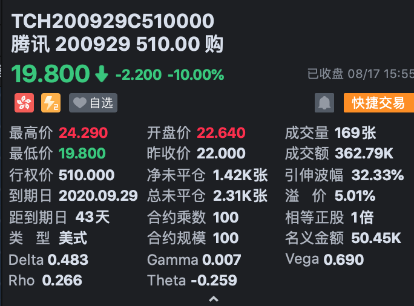

## 期权是什么？
期权，期是未来，权是权利，合起来就是一份未来的权利。

> 类似一个保险，买方相当于投保人，卖方相当于保险公司。当我们购买一份保险（期权）时，需要支付一定的保费（期权价格/权利金）。

1.到期日

约定交割的日期。买方有权在当天选择行权或者不行权。

2.行权价

约定交割的价格。买方在行权时执行的价格，以这个价格 买/卖 约定的物品（股票、货物等）

3.期权价格

在市场上流通，价格随着各种因素（到期日、行权价等）的影响不断变化。

4.底层资产

约定交割的物品（股票、货物等）

> 欧式期权： 类似电影票，只能在到期日那天行权（看电影）

> 美式期权： 类似月饼票，可以在到期日前任意一天行权（提月饼）

## 举例
腾讯 购 200929 510

到期日是20年9月29日。行权价是510元，底层资产是腾讯的股票。
购/C 是看涨期权， 沽/P 是看跌期权。
期权价格是19.8元。